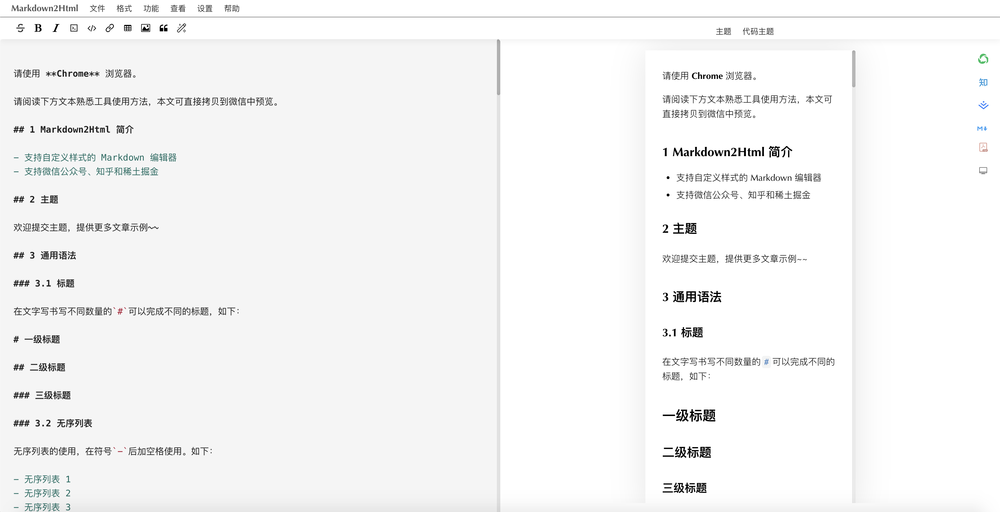

<h1 align="center">Markdown2Html</h1>

## 简介

Fork 自 [markdown2html](https://github.com/TaleAi/markdown2html)，略有调整。

- 支持自定义样式的 Markdown 编辑器
- 支持微信公众号、知乎和稀土掘金
- 支持公式
- 支持 html 转 markdwon
- 支持导出 pdf 和 markdown
- 欢迎在线使用：
  - https://kebinzhi.github.io/Markdown2Html/
  - https://md.weiyan.cc/

## 主题

> 主题: <https://github.com/macrozheng/mall-learning/blob/master/document/json/localThemeList.json>

> 欢迎提交主题，提供更多文章示例~~

## 友情链接

- [markdown2html](https://github.com/TaleAi/markdown2html)：markdown2html
- [markdown nice](https://mdnice.com/)：markdown nice
