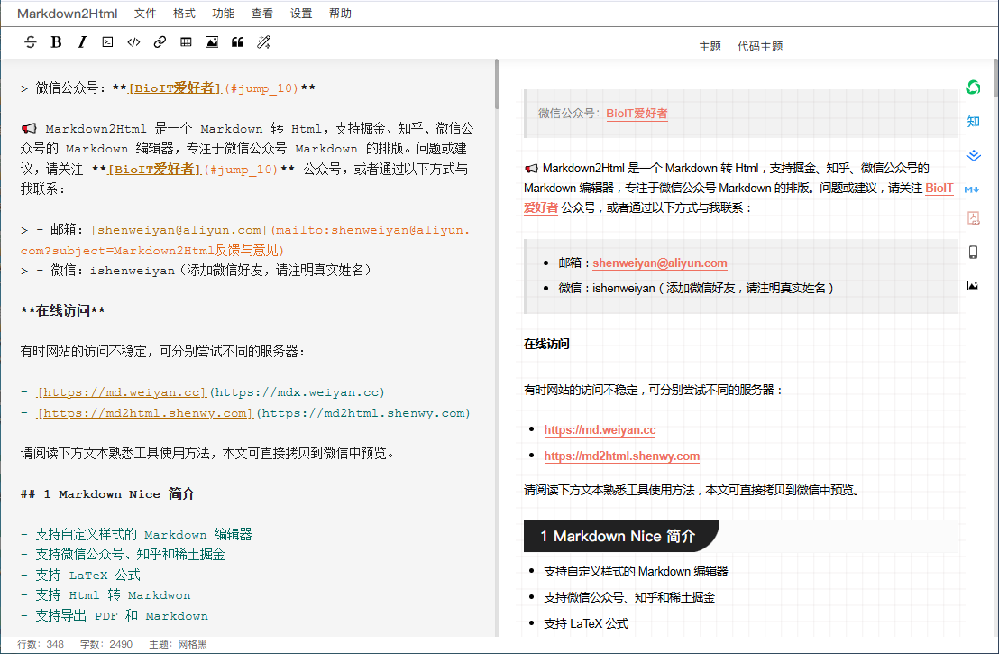

<h1 align="center">Markdown2Html</h1>

## 简介

一款 Markdown 转 Html，支持掘金、知乎、微信公众号的 Markdown 编辑器，根据个人的使用需求（主要用于 **微信公众号** 排版），内容与功能有调整。

- 支持自定义样式的 Markdown 编辑器
- 支持微信公众号、知乎和稀土掘金
- 支持 LaTeX 公式
- 支持 Html 转 Markdwon
- 支持导出 PDF 和 Markdown
- 欢迎在线使用
  - https://md.weiyan.cc/
  - https://md2html.shenwy.com/

## 主题

[Markdown2Html 主题列表](https://github.com/shenweiyan/Markdown2Html/tree/main/src/template/markdown)

欢迎提交主题，提供更多文章示例~~

## 友情链接

- [markdown2html](https://github.com/TaleAi/markdown2html)
- [markdown nice](https://github.com/mdnice/markdown-nice)

## 赞赏 

如果你觉得到 Markdown2Html 对你有帮助，欢迎赞赏，有你的支持，Markdown2Html 一定会越来越好！      

